<p align="center">
  
</p>

<h1 align="center">CouchElephant</h1>
<p align="center"><b>A CouchElephant never forgets.</b></p>

Plex's DVR records the wrong broadcast. Ask it to record your team and it will
happily pick the repeat that airs two days later, on a channel you do not
watch, and tell you nothing about it. CouchElephant reads the same guide, picks
the live broadcast itself, and pins the recording to that exact channel and
start time so Plex has nothing left to choose.

It sits beside Plex. It does not replace it, proxy it, or ask you to watch
anything anywhere else. Recordings land in your Plex library exactly as they
always did.

Version 0.90.

---

## Why it exists

Plex's guide already flags the live airing as a premiere. Plex ignores that
flag and breaks the tie on the lowest channel number. This is a
[known bug](https://forums.plex.tv/t/dvr-scheduling-wrong-airing-of-mlb-baseball-games/910902),
reported in March 2025 and still open.

CouchElephant reads the flag, chooses the airing, and creates a one-shot
recording pinned with `lineupChannel` and `startTimeslot`. Every decision it
makes, including the ones it declines, is written down and shown to you.

It also does two things Plex cannot say at all:

- **Limit a rule to several networks or channels.** A Plex rule takes one
  channel, or none. "Only ABC, CBS and FOX" cannot be expressed to Plex, so
  CouchElephant keeps that rule itself and books each airing as it comes.
- **Always take the live broadcast**, for every game a team plays, without you
  looking at the guide.

## What it looks like

### The guide

A real two-axis guide. Channels down, time across, both loading more as you
reach the edge. Amber means CouchElephant scheduled it, blue-grey means Plex
did.

| Dark | Light |
| --- | --- |
| 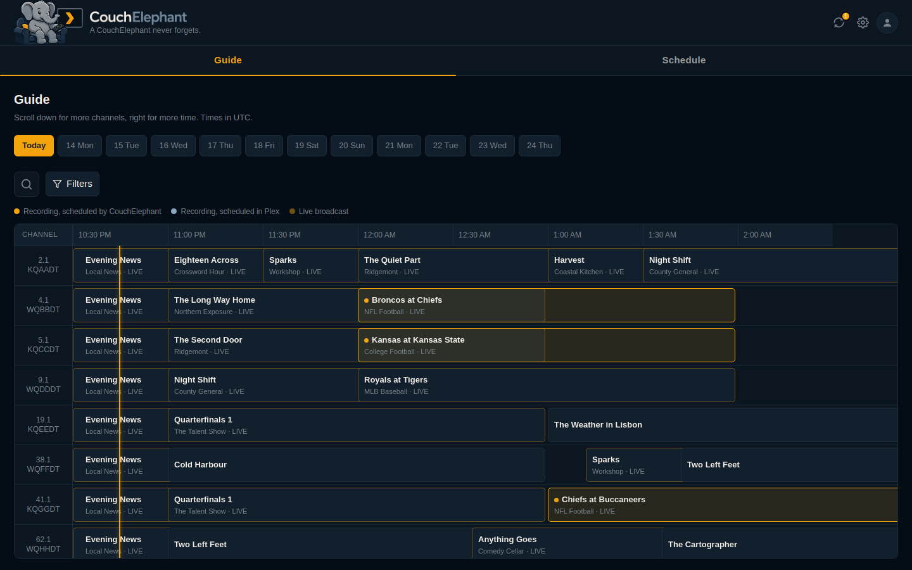 | 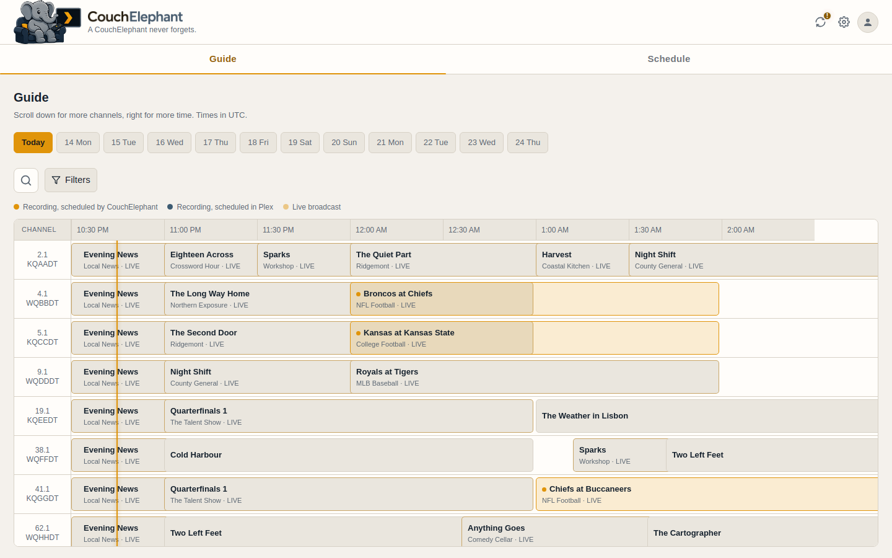 |

### Choosing what to record

Press record and you get Plex's own options, read from Plex rather than copied
here, plus CouchElephant's. Each row is marked with whose feature it is, and a
bar across the top says which of the two will end up owning the recording.

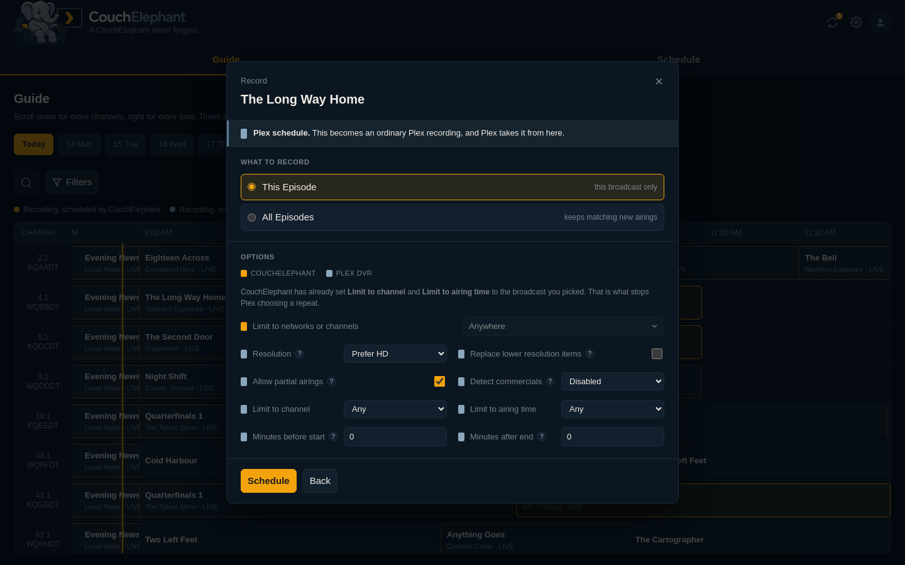

Opening a programme shows every airing of it, which one is live, and why it is
being recorded if it already is.

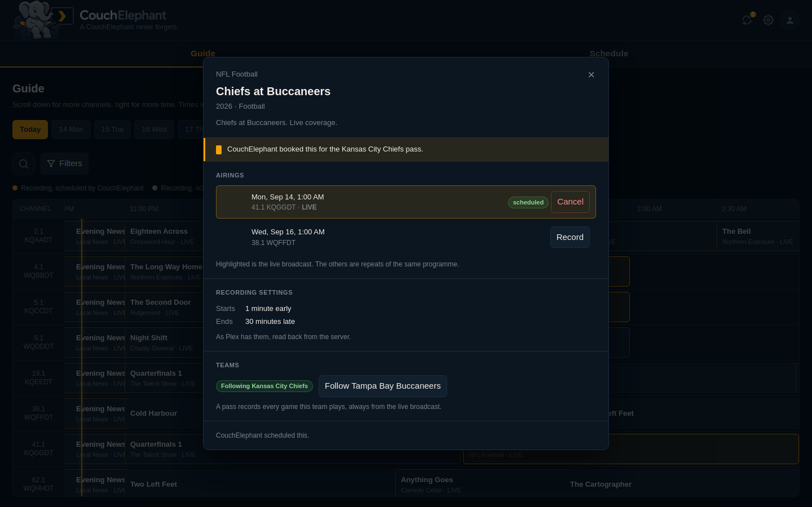

### The schedule

What your Plex server will actually record, read from Plex's own grab list. Two
views over the same data, and every entry says who booked it and why.

| Agenda | Calendar |
| --- | --- |
| 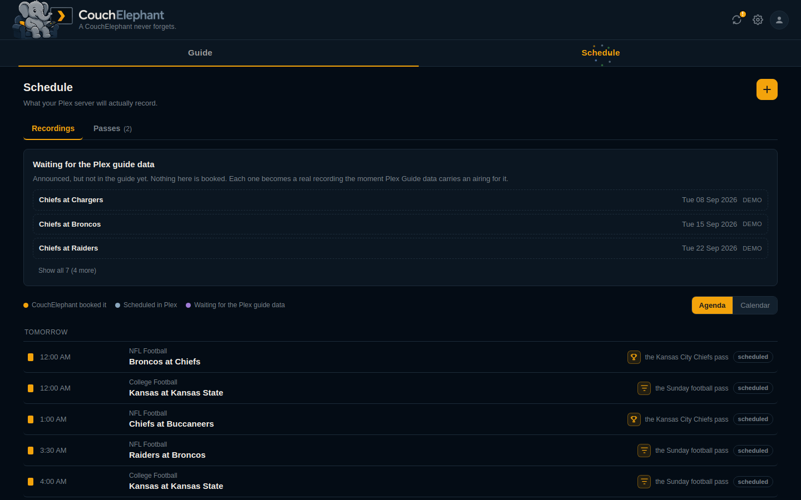 | 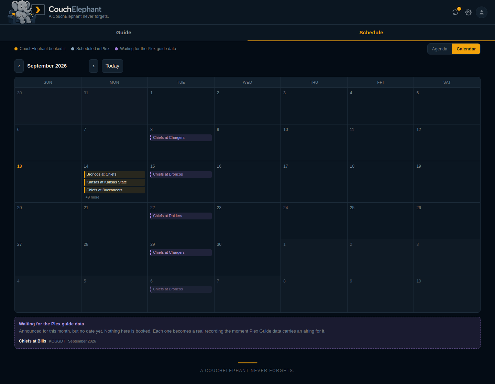 |

### Passes

A pass keeps matching new airings on its own. Open one to see what it will
record next and why it chose that broadcast. Plex's own rules are listed here
too, in the other colour.

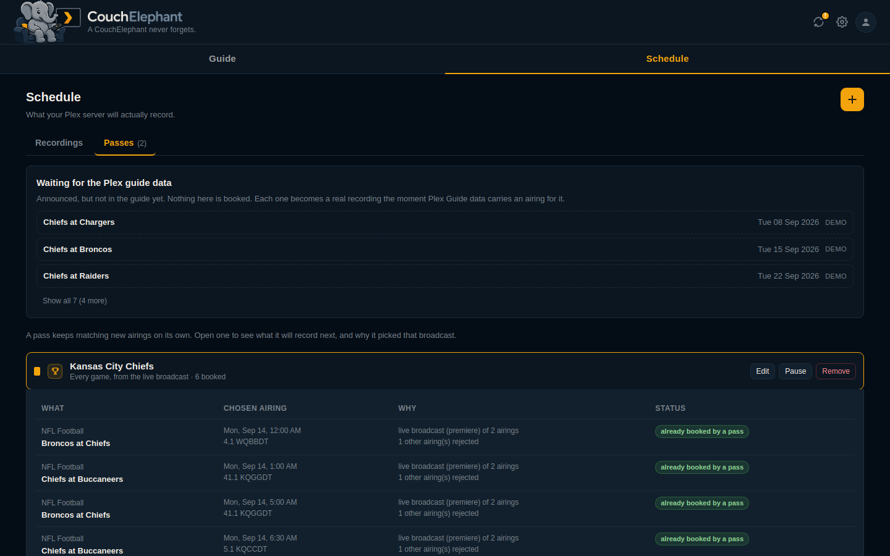

### Adding a schedule

Follow a team or a programme. Leave the source limit alone and it becomes an
ordinary Plex rule. Name more than one network and CouchElephant keeps it.

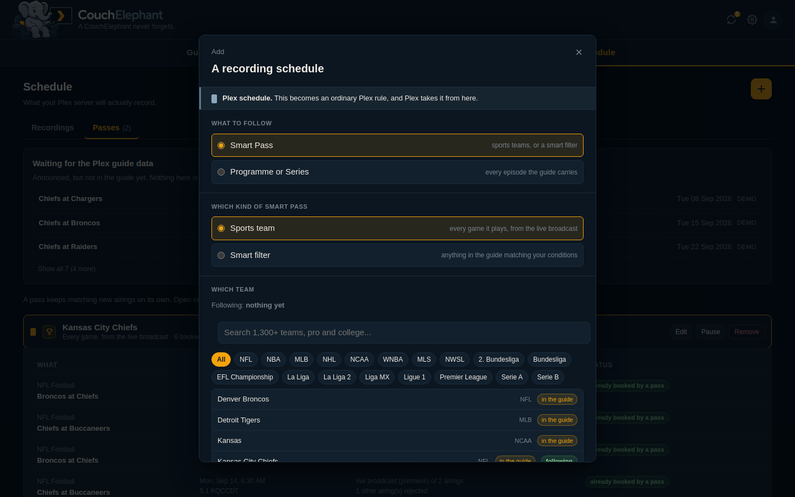

### Settings

Sections down the left, sub-tabs inside each, and a search that reads all of
them.

| Plex | Accounts | Channel artwork |
| --- | --- | --- |
| 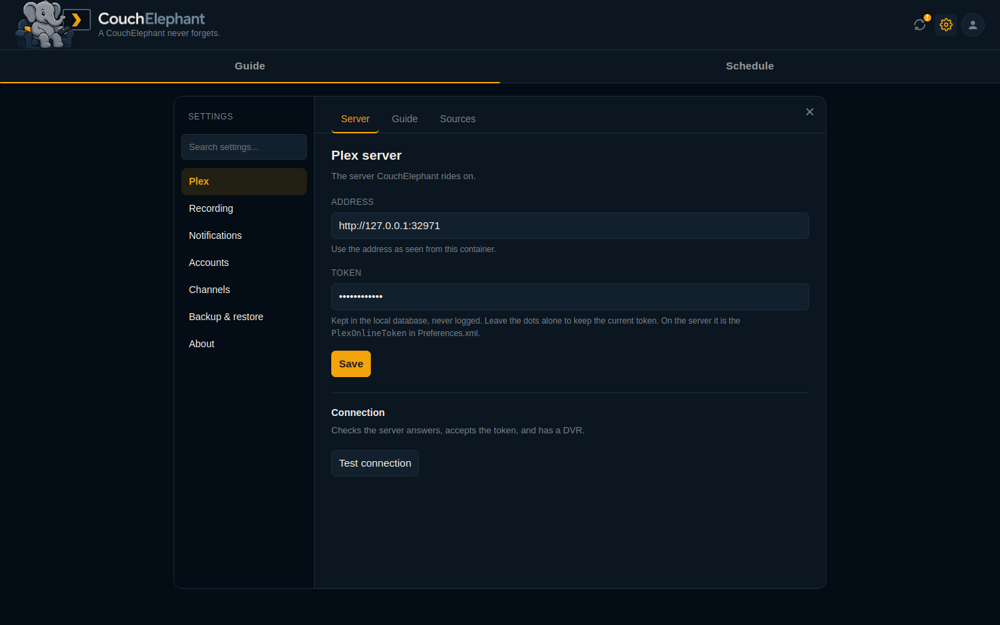 | 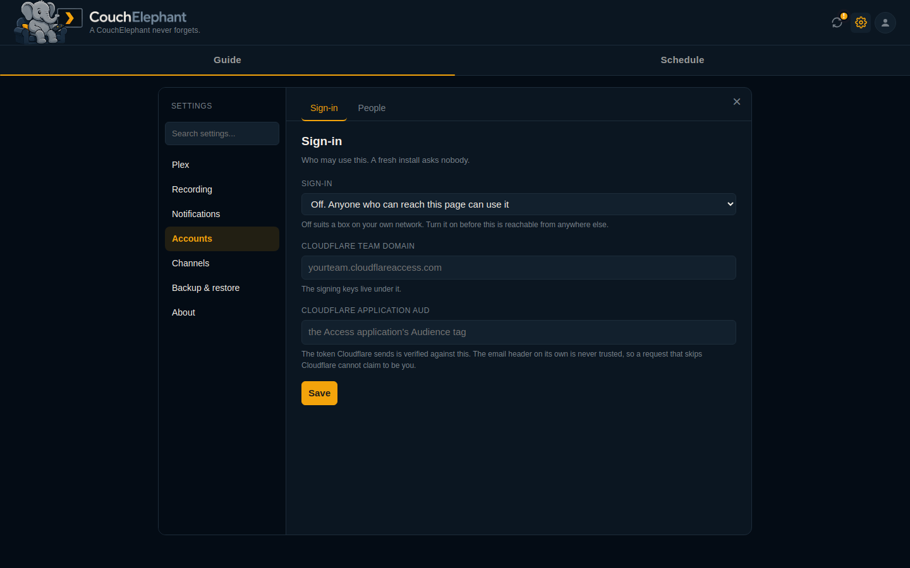 | 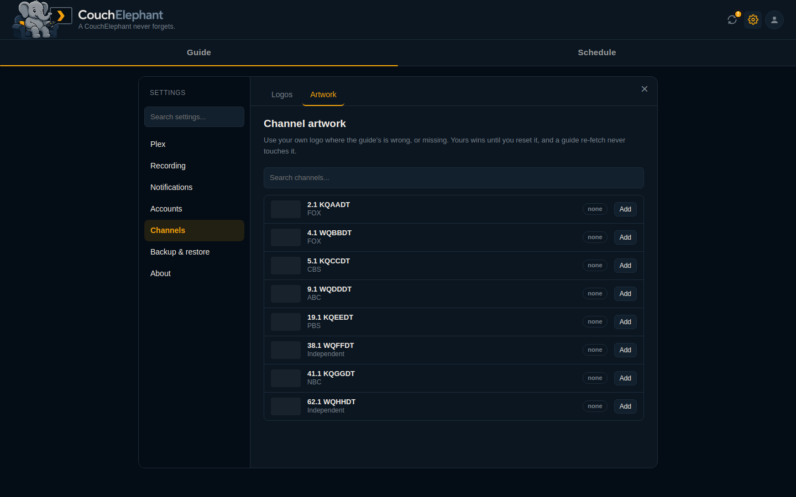 |

### First run

It asks for the one thing it needs, tests it before saving, and tells you what
you can leave for later.

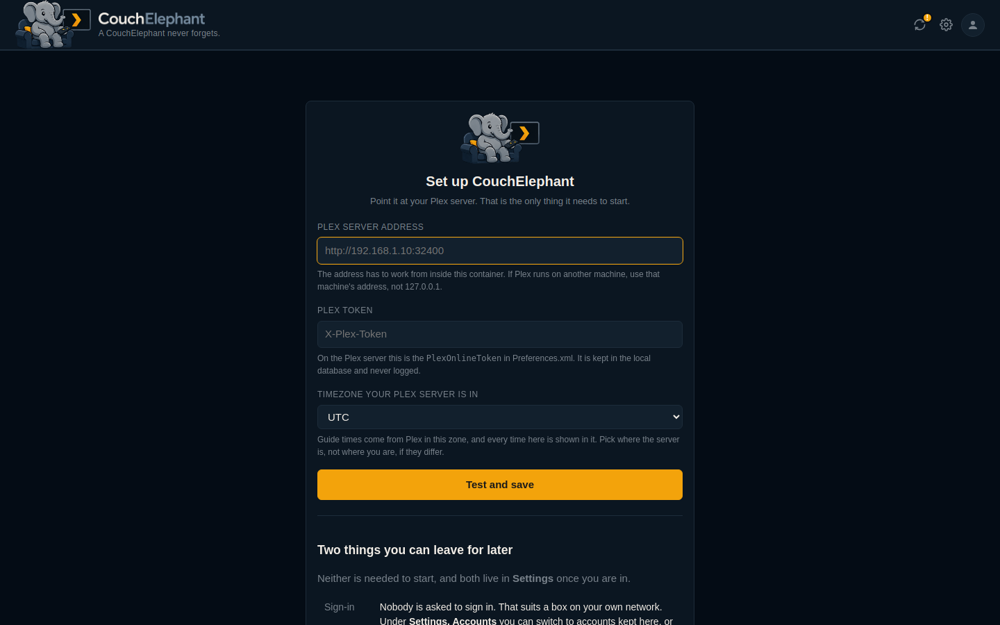

### On a phone

| Guide | Recordings |
| --- | --- |
| 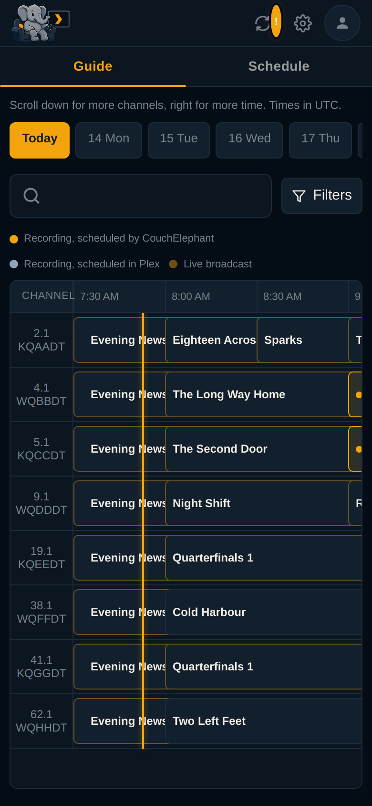 | 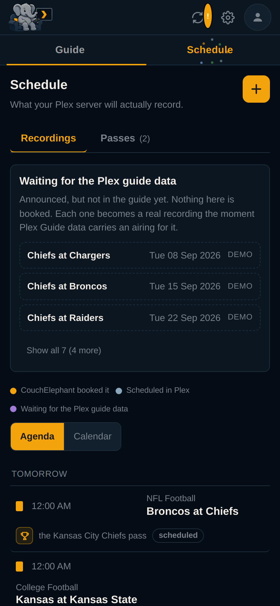 |

## Getting started

You need a Plex Media Server with a DVR, and Docker.

```bash
git clone git@github.com:datbird/couchelephant.git
cd couchelephant
docker build -t couchelephant .
docker run -d --name couchelephant --restart unless-stopped \
  -p 8710:8710 \
  -v /opt/couchelephant/data:/data \
  -e TZ=UTC \
  couchelephant
```

Open `http://your-host:8710`, and in **Settings, Plex** put in your server
address and token. The address has to work from inside the container, so
`127.0.0.1` only works if Plex runs in it too.

**Preview mode is on for a new install.** Rules work out which airing they
would choose and show it, but nothing is written to your DVR. Turn it off under
**Settings, Recording** once the choices look right.

**Nobody is asked to sign in** on a new install, which suits a box on your own
network. Turn on local accounts or Cloudflare Access under **Settings,
Accounts** before this is reachable from anywhere else.

Full instructions are in [docs/INSTALL.md](docs/INSTALL.md).

## Tests

```bash
./scripts/test.sh
```

195 checks: the airing choice, the pin, the Plex client against a fake server
that reproduces the real one's quirks, every endpoint, and a browser suite that
drives the guide, the record panel, the recordings page, settings, the phone
layout and first run. It refuses to start unless every path it would write to
is scratch. See [docs/DEVELOPING.md](docs/DEVELOPING.md).

## Documentation

| | |
| --- | --- |
| [Install and configure](docs/INSTALL.md) | Docker, volumes, environment, the Plex token |
| [How recording works](docs/RECORDING.md) | Choosing the airing, passes, source limits, who owns a rule |
| [Architecture](docs/ARCHITECTURE.md) | Modules, the database, the sync loop |
| [HTTP API](docs/API.md) | Every endpoint |
| [Accounts](docs/AUTH.md) | Off, local, or Cloudflare Access |
| [Developing](docs/DEVELOPING.md) | Running it locally, the test suite, the deploy script |
| [Plex API notes](docs/PLEX-NOTES.md) | What the server really returns, and the traps in it |

## Licence

MIT. See [LICENSE](LICENSE). Third-party notices are in
[THIRD_PARTY.md](THIRD_PARTY.md).
